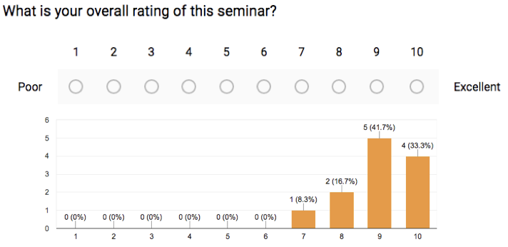

As faculty at Penn, I was invited to give a noon conference for the interns and residents in the internal medicine residency program. I selected a topic for which we commonly received consults, and then developed cases, MKSAP-style multiple choice questions, and a presentation, and then led an educational session. The slides are below.

<iframe src="https://docs.google.com/presentation/d/e/2PACX-1vTOdK_FvKr_KQ0KBN7JvfVt0JTw-AmD614yYtBbb5gCYwcypOohRO-Bf1WTuOvko7PwyvYz3Nap7K3C/embed?start=false&loop=false&delayms=3000" frameborder="0" width="960" height="749" allowfullscreen="true" mozallowfullscreen="true" webkitallowfullscreen="true"></iframe>

## Learner Evaluations

Overall evaluation (N=12 of ~30)  

#### Qualitative  
"Great, learned a lot!"  
"Enjoyed the QA format"
